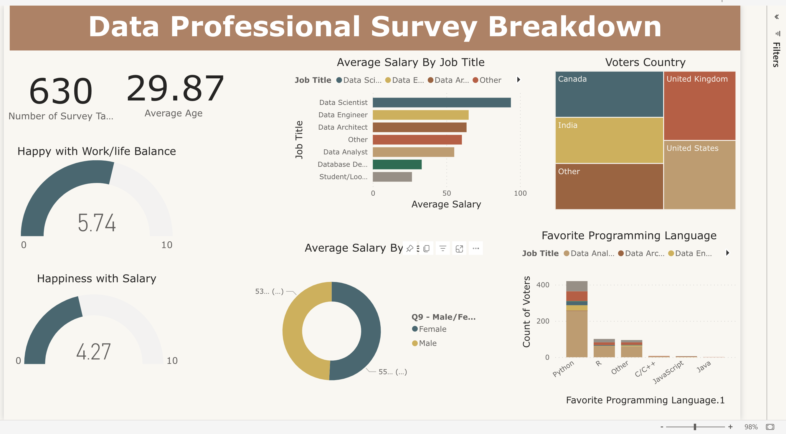

# Power BI Portfolio Project

## Data professional Survey Breakdown

## Introduction 

Diving into the world of data professionals worldwide, my project extracts valuable insights from a comprehensive Data Professional Survey Breakdown. After meticulous data cleaning and transformation, we answer key questions about survey participants' demographics, preferences, and job satisfaction. This exploration spans participant count, average age, countries of origin, programming language preferences, salary averages by job title and gender, and work/life balance and salary satisfaction on a scale of 1 to 10. Join me on this concise yet revealing journey into the realm of data professionals

### Power BI Features used

In this project, I harnessed a range of powerful features and techniques to transform raw survey data into actionable insights. Here are some of the notable Power BI features and concepts applied:

- Data Cleaning and Transformation(remove column, split column, replace values and more..)
- DAX Concepts
- Custom Column Creation
- Visualizations
- Slicers and filters

  **Note**: Since I only have one table in the project and I do not have to join two tables, did not do any **Data Modelling** in this project.

  ## Dashboard

  

  You can interact with the report [HERE](https://app.powerbi.com/groups/me/reports/93ae8de3-11fa-4c8f-a7a0-11e84a7384e8/ReportSection?experience=power-bi)

  ## Summary

  In this Power BI-driven data exploration project, we transformed and visualized raw survey data using features like data cleaning, DAX calculations, custom column creation, and interactive visuals. Our analysis unveiled insights into the global data professional landscape, answering questions about demographics, preferences, and job satisfaction.

  
